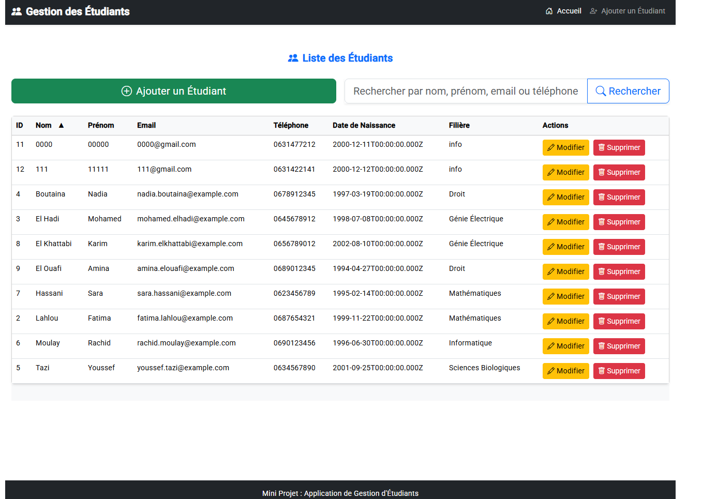

# 🎓 Mini Projet - Gestion des Étudiants

Une application complète de gestion des étudiants développée avec Angular et Node.js, permettant d'effectuer toutes les opérations CRUD (Create, Read, Update, Delete) avec une interface moderne et responsive.



*Interface principale de l'application avec la liste des étudiants et fonctionnalité de recherche*

## 📱 Captures d'écran

### 🏠 Liste des étudiants - Interface principale


*Tableau complet des étudiants avec barre de recherche, pagination et actions (Modifier/Supprimer). L'interface affiche tous les détails des étudiants : ID, Nom, Prénom, Email, Téléphone, Date de naissance, et Filière.*

### ➕ Formulaire d'ajout d'étudiant


*Formulaire moderne avec validation pour ajouter un nouvel étudiant. Comprend tous les champs requis : Nom, Prénom, Email, Téléphone, Date de naissance, et une liste déroulante pour la Filière.*

## ✨ Fonctionnalités

- ✅ **Gestion complète des étudiants** (CRUD)
- ✅ **Interface moderne** avec Angular Material et Bootstrap
- ✅ **Recherche en temps réel** par nom, prénom ou filière
- ✅ **Design responsive** (compatible mobile/tablette)
- ✅ **Validation des formulaires** avec messages d'erreur
- ✅ **Notifications utilisateur** avec snackbar
- ✅ **Pagination** pour les grandes listes
- ✅ **Base de données MySQL** avec API REST

## 🛠️ Technologies utilisées

### Frontend
- **Angular 16** - Framework web
- **Angular Material** - Composants UI
- **Bootstrap 5** - Framework CSS
- **TypeScript** - Langage de programmation
- **Reactive Forms** - Gestion des formulaires

### Backend
- **Node.js** - Runtime JavaScript
- **Express.js** - Framework web
- **MySQL** - Base de données
- **dotenv** - Variables d'environnement

## 🚀 Installation et configuration

### Prérequis
- Node.js (v14+)
- MySQL Server
- Angular CLI (`npm install -g @angular/cli`)

### 1. Cloner le projet
```bash
git clone <votre-repo>
cd mini_projet
```

### 2. Configuration de la base de données
```sql
CREATE DATABASE gestion_etudiants;
```

Ensuite, importer le schéma :
```bash
mysql -u root -p gestion_etudiants < database/etudiant.sql
```

### 3. Configuration du backend
```bash
cd Back_end
npm install
```

Configurer le fichier `.env` :
```env
DB_HOST=localhost
DB_USER=root
DB_PASSWORD=votre_mot_de_passe
DB_NAME=gestion_etudiants
PORT=3000
```

### 4. Configuration du frontend
```bash
cd ../Front_end
npm install
```

### 5. Lancement de l'application

**Terminal 1 - Backend :**
```bash
cd Back_end
npm start
```

**Terminal 2 - Frontend :**
```bash
cd Front_end
ng serve
```

L'application sera accessible sur `http://localhost:4200`

## 📊 Structure du projet

```
mini_projet/
├── Back_end/              # API REST Node.js
│   ├── server.js          # Serveur principal
│   ├── package.json       # Dépendances backend
│   └── .env               # Variables d'environnement
├── Front_end/             # Application Angular
│   ├── src/app/
│   │   ├── student-list/  # Composant liste
│   │   ├── student-form/  # Composant formulaire
│   │   ├── nav/           # Navigation
│   │   └── footer/        # Pied de page
│   └── package.json       # Dépendances frontend
├── database/              # Scripts SQL
│   └── etudiant.sql       # Schéma de base
└── screenshots/           # Captures d'écran
```

## 🌐 API Endpoints

| Méthode | URL | Description |
|---------|-----|-------------|
| GET | `/etudiants` | Récupérer tous les étudiants |
| GET | `/etudiants/:id` | Récupérer un étudiant par ID |
| POST | `/etudiants` | Ajouter un nouvel étudiant |
| PUT | `/etudiants/:id` | Modifier un étudiant |
| DELETE | `/etudiants/:id` | Supprimer un étudiant |

### Exemple de réponse JSON :
```json
[
  {
    "id": 1,
    "nom": "Alami",
    "prenom": "Ahmed",
    "email": "ahmed.alami@example.com",
    "tel": "0612345678",
    "date_naissance": "2000-01-15",
    "filiere": "Informatique"
  }
]
```

## 🎯 Utilisation

1. **Ajouter un étudiant** : Cliquez sur "Ajouter un étudiant", remplissez le formulaire
2. **Rechercher** : Utilisez la barre de recherche pour filtrer par nom, prénom ou filière
3. **Modifier** : Cliquez sur l'icône "modifier" à côté d'un étudiant
4. **Supprimer** : Cliquez sur l'icône "supprimer" (avec confirmation)

## 🐛 Problèmes fréquents

**La base de données ne se connecte pas ?**
- Vérifiez que MySQL est démarré
- Contrôlez les paramètres dans le fichier `.env`
- Assurez-vous que la base `gestion_etudiants` existe

**Angular ne démarre pas ?**
- Essayez `npm install -g @angular/cli`
- Supprimez `node_modules` et refaites `npm install`

**Erreurs CORS ?**
- Le backend a déjà CORS activé, cela devrait fonctionner

## 📝 Comment prendre des captures d'écran

Pour mettre à jour les captures d'écran :

1. Lancez l'application avec quelques données de test
2. Prenez des captures d'écran des différentes vues
3. Sauvegardez-les dans le dossier `screenshots/` avec ces noms :
   - `student-list-view.png` - Vue principale avec la liste des étudiants
   - `add-student-form.png` - Formulaire d'ajout d'étudiant

**Note :** Les captures d'écran actuelles montrent parfaitement les fonctionnalités principales de l'application !

## 🔮 Améliorations futures

- 🔐 Authentification utilisateur
- 📊 Export Excel/PDF
- 📸 Photos d'étudiants
- 🧪 Tests unitaires
- 🐳 Containerisation Docker

## 📄 Licence

MIT License - Vous pouvez utiliser ce code comme vous le souhaitez.

---

*Projet développé dans le cadre d'un mini-projet universitaire*
