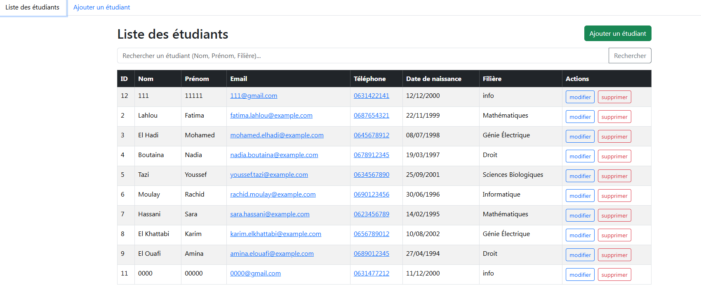

# Angular Student CRUD

Simple student management app built with Angular and Node.js. Basic CRUD operations with a clean interface.



*Student list view with search functionality*

## What it does

## What it does

This app lets you manage student records. You can add new students, edit existing ones, delete them, and search through the list. Nothing fancy, just the basics done right.

**Main features:**
- Add/edit/delete students
- Real-time search
- Responsive design (works on mobile)
- Form validation

## Built with

## Built with

**Frontend:**
- Angular 16
- Bootstrap 5 
- TypeScript

**Backend:**
- Node.js + Express
- MySQL database

Pretty standard stack. Nothing too crazy.

## Getting started

You'll need Node.js, MySQL, and Angular CLI installed.

## Getting started

You'll need Node.js, MySQL, and Angular CLI installed.

**Quick setup:**

1. Clone this repo
```bash
git clone https://github.com/MbarekTech/angular-student-crud.git
cd angular-student-crud
```

2. Set up the database
```sql
CREATE DATABASE gestion_etudiants;
```
Then import the schema:
```bash
mysql -u root -p gestion_etudiants < database/schema.sql
```

3. Start the backend
```bash
cd backend
npm install
node server.js
```

4. Start the frontend
```bash
cd mini_projet  
npm install
ng serve
```

That's it. Backend runs on port 5000, frontend on 4200.

## API endpoints

## API endpoints

Simple REST API:

| Method | URL | What it does |
|--------|-----|-------------|
| GET | `/etudiants` | Get all students |
| GET | `/etudiants/:id` | Get one student |
| POST | `/etudiants` | Add new student |
| PUT | `/etudiants/:id` | Update student |
| DELETE | `/etudiants/:id` | Delete student |

Example response:
```json
[
  {
    "id": 1,
    "nom": "Alami",
    "prenom": "Ahmed", 
    "email": "ahmed.alami@example.com",
    "tel": "0612345678",
    "date_naissance": "2000-01-15",
    "filiere": "Informatique"
  }
]
```

## How to use it

## How to use it

Pretty straightforward:

- **Add students**: Click the add button, fill the form
- **Search**: Type in the search box - searches name and major  
- **Edit**: Click edit next to any student
- **Delete**: Click delete (it asks for confirmation)

The interface is in French since this was originally for a French university project.

## Project structure

```
angular-student-crud/
├── backend/           # Express API
│   ├── server.js      # Main server file  
│   └── package.json   
├── mini_projet/       # Angular app
│   ├── src/app/
│   │   ├── student-list/    # List component
│   │   ├── student-form/    # Add form
│   │   ├── edit-student/    # Edit form  
│   │   └── student.service.ts # API calls
│   └── package.json
└── database/
    └── schema.sql     # DB setup
```

## Common issues

## Common issues

**Database won't connect?**
- Make sure MySQL is running
- Check your password in `backend/server.js`
- Database name is `gestion_etudiants`

**Angular won't start?**  
- Try `npm install -g @angular/cli` first
- Delete `node_modules` and run `npm install` again

**CORS errors?**
- Backend already has CORS enabled, should work fine

## What's next

Some things I might add later:
- User login/auth
- Export to Excel 
- Student photos
- Better validation
- Tests (I know, I know...)

## License

MIT - do whatever you want with it.

---

Made this for a university project. Pretty basic but it works!
